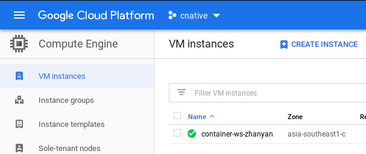
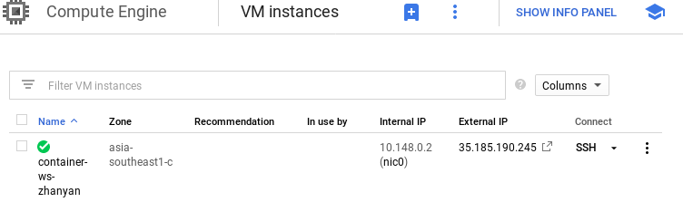

# Cloud Native/Containers - Practical
Practical for Workshop on Containers with Docker

## Intro
In this practical, we will apply the container know how we learnt by:
- using Docker to containerize a backend of a web application.
- using Docker to containerize a frontend of a web application.
- using Docker Compose hook up the containers to allow them to work together.
    - use a pre-built docker image to provide a database to the backend.
- deploying the stack on a Google Cloud server.

## Instructions
### Install Docker & Docker-Compose
0. Install Docker 
    - Windows
        - Windows 10 64-bit: Pro, Enterprise, or Education with Hyper-V enabled: [Docker Desktop](https://docs.docker.com/docker-for-windows/install/)
        - Other Windows: [Docker Toolbox](https://docs.docker.com/toolbox/overview/)
    - MacOS [Docker Desktop](https://docs.docker.com/docker-for-mac/install/)
    - Linux [get-docker.sh](https://docs.docker.com/install/linux/docker-ce/ubuntu/#install-using-the-convenience-script)

### Building Docker Images
1. use Docker to containerize a backend of a web application.
    - complete `containers/backend/Dockerfile` to build the backend docker container
2. use Docker to containerize a frontend of a web application.
    - complete `containers/frontend/Dockerfile` to build the frontend docker container

### Hooking up Images with Compose
3. use Docker Compose hook up the containers to allow them to work together.
    - register for account on [Docker Hub](https://hub.docker.com/). Take note of your username (aka docker id)
    - authenticate with your new docker hub account on your machine with `docker login`
    - complete `docker-compose.yml` to define the app's stack
        - make sure you tag the docker images that you in the format: `<username>/<name of image>`
    - make a copy `env` as `.env` and complete it with environment config
    - run `docker-compose build` to build the images
    - push the built images to Docker Hub with `docker-compose push`
### Deploying on Google Cloud
4. deploying the stack on a Google Cloud server.
    1. start a cloud server on [Google Compute Engine](https://console.cloud.google.com/compute/instances?project=cnative-259900)
         
         - click `Create Instance` to start the wizard to create an instance 
         - name the server instance in the format: `container-ws-<your-name-separated-by-dashes>`
         - use the region that you have been assigned. Leave the zone as default
         - select the Ubuntu 18.04 LTS image to create the boot disk. Leave type and size as default.
         - check `Allow HTTP traffic` to allow access to the frontend once deployed.
         - create the cloud server
    ---
    2. 
        - wait for your cloud server to start up. (wait for green tick).
        - connect to your cloud server by clicking the `SSH` button
    3. Install `docker` and `docker-compose`
        - run `get-docker.sh` script to install docker
            - `curl -fsSL https://get.docker.com -o get-docker.sh`
            - `sudo sh get-docker.sh`
        - install docker-compose
            - `sudo apt-get install python3-pip`
            - `sudo pip3 install docker-compose`
    4. Deploy the stack with `docker-compose`
        - using a text editor (ie `nano`) copy the `.env` file to your server
        - using a text editor (ie `nano`) copy the `docker-compose.yml` file to your server
        - pull the docker images from Docker Hub:
            - `sudo docker pull <username>/postgres:12.0-alpine`
            - `sudo docker pull <username>/memento-backend`
            - `sudo docker pull <username>/memento-frontend`
        - using a text editor (ie `nano`) and edit the `docker-compose.yml` file 
            - change the host port mapping for frontend  from `3000` to `80`
            - change the host port mapping for backend  from `5000` to `443`
            - change `REACT_APP_API_HOST` to `<your servers ip>:443`
        - delete the volumes section for the frontend in `docker-compose.yml`
        - bring up the stack with `sudo docker-compose up`
    5.  Access the app at the your server's external IP

> The change of ports is required to ensure that we can access the app through
> firewalls, which typically do not not block ports 443 and 80.

## App Infomation
Infomation about the web application that are useful for this practical:
- Database - provides data storage for the backend 

| Attribute | Description | Value |
| --- | --- | --- |
| Kind | Kind of SQL Database Server | PostgreSQL 12.0 |
| Port | Port that the server listens on | 5432 |
| Storage Path | Path where the database server stores the data | `/var/lib/postgresql/data` |

| Environment Variable | Description |
| --- | --- |
| `POSTGRES_USER` | Username of the user used to authenticate with the database |
| `POSTGRES_PASSWORD` | Password of the user used to authenticate with the database |

- Backend - backend of the web application, exposes a REST API that the frontend uses

| Attribute | Description | Value |
| --- | --- | --- |
| Platform | Programming language used to implement the backend | Python 3.7 |
| Libraries | Library/Module dependencies used to implement the backend | Listed in `requirements.txt ` |
| Port | Port that the backend server listens on | 5000 |

| Environment Variable | Description |
| --- | --- |
| `SQL_DATABASE` | Kind of SQL Database to use (`sqlite` or `postgresql`) |
| `DATABASE_HOST` | DNS name/IP address of the database server. |
| `POSTGRES_USER` | Username of the user used to authenticate with the database |
| `POSTGRES_PASSWORD` | Password of the user used to authenticate with the database |

- Frontend - frontend of the web appication, displays a simple interface to
                create and delete organisations

| Attribute | Description | Value |
| --- | --- | --- |
| Platform | Frontend is built on NodeJS and the ReactJS framework | NodeJS 12.2.0 |
| Libraries | Library/Module dependencies used to implement the frontend | Listed in `package.json ` |
| Port | Port that the frontend server listens on | 3000 |

| Environment Variable | Description |
| --- | --- |
| `BACKEND_HOST` | DNS name/IP address where clients can access the backend |
| `REACT_APP_API_HOST` | DNS name/IP address where external clients can access the backend API |
